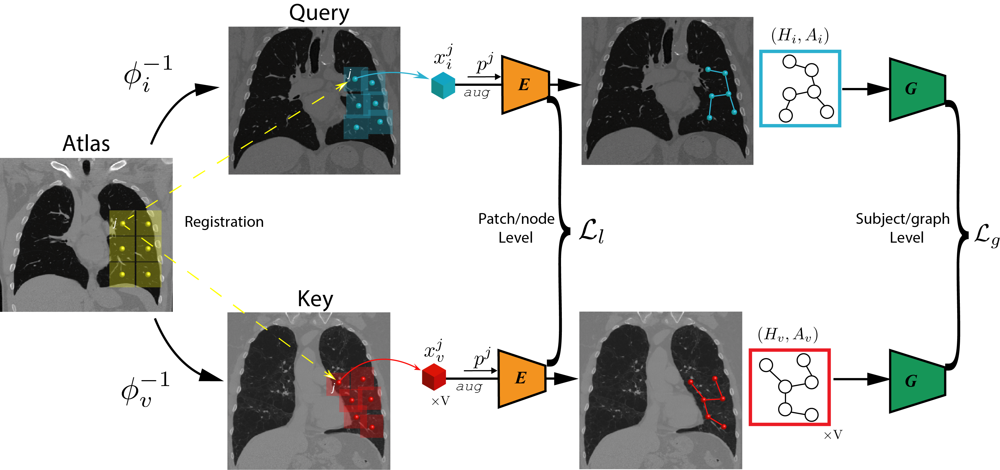

# Context Matters: Graph-based Self-supervised Representation Learning for Medical Images

Official PyTorch implementation for paper *Context Matters: Graph-based Self-supervised Representation Learning for Medical Images*, accepted by *AAAI 2021*.

Li Sun\*, Ke Yu\* and Kayhan Batmanghelich

<p align="center">
  
</p>

## Absrtact
Supervised learning method requires a large volume of annotated datasets. Collecting such datasets is time-consuming and expensive. Until now, very few annotated COVID-19 imaging datasets are available. Although self-supervised learning enables us to bootstrap the training by exploiting  unlabeled data, the generic self-supervised methods for natural images do not sufficiently incorporate the context. For medical images, a desirable method should be sensitive enough to detect deviation from normal-appearing tissue of each anatomical region; here, anatomy is the context. We introduce a novel approach with two levels of self-supervised representation learning objectives: one on the regional anatomical level and another on the patient-level. We use graph neural networks to incorporate the relationship between different anatomical regions. The structure of the graph is informed by anatomical correspondences between each patient and an anatomical atlas. In addition, the graph representation has the advantage of handling any arbitrarily sized image in full resolution. Experiments on large-scale Computer Tomography (CT) datasets of lung images show that our approach compares favorably to baseline methods that do not account for the context. We use the learnt embedding to quantify the clinical progression of COVID-19 and show that our method generalizes well to COVID-19 patients from different hospitals. Qualitative results suggest that our model can identify clinically relevant regions in the images.

### Requirements
- PyTorch 1.4
- SimpleITK
- easydict
- [torch_geometric](https://github.com/rusty1s/pytorch_geometric)
- [monai](https://github.com/Project-MONAI/MONAI)
- [tensorboard\_logger](https://github.com/TeamHG-Memex/tensorboard_logger)
- [ANTs](http://stnava.github.io/ANTs/)

### Preprocess Data
Please follow the instructions in [./preprocess/README.md](./preprocess/README.md)

### Training
```bash
sh train.sh
```
The hyperparameter setting can be found in train.sh
### Evaluation
```
python test.py
```
